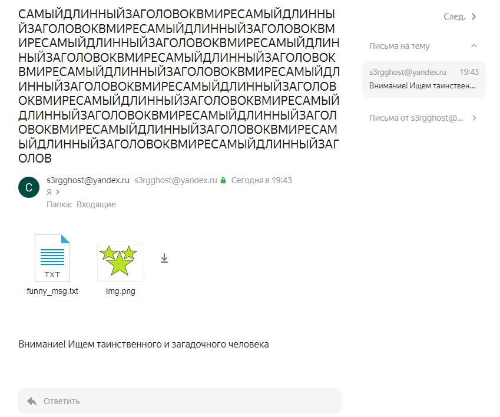

# Internet Protocols
## Task5: SMTP-CLIENT

### Описание:
SMTP клиент. Пользователь может написать текст письма на английском или русском языке в текстовом файле. В конфигурационном файле пользователь указывает адреса отправителя и получателя(ей) на Яндекс Почте, тему (возможно, на русском языке) и путь до папки с файлами-вложениями, которые нужно отправить. Письмо с этими данными отправляется на почту получателя(ей) на Яндекс Почте.

### Запуск:
1.  Пример запуска
```
> py smtp_client.py
```

### Демонстрация работы программы:



