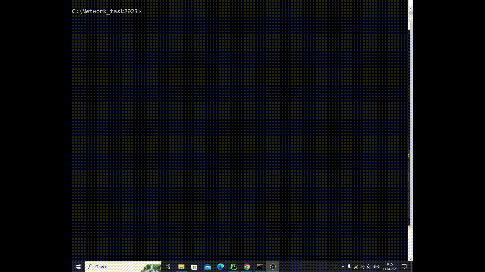

# Internet Protocols
## Task1.1: Trace_AS

### Описание:
Трассировка автономных систем. Пользователь вводит доменное имя
или IP адрес. Осуществляется трассировка до указанного узла , т. е. мы узнаем IP адреса маршрутизаторов, через которые проходит пакет. Необходимо определить к какой автономной системе относится каждый из полученных IP адресов
маршрутизаторов.

### Запуск:
1.  Пример запуска
```
>>> python main.py 8.8.8.8
```

### Демонстрация работы программы:


