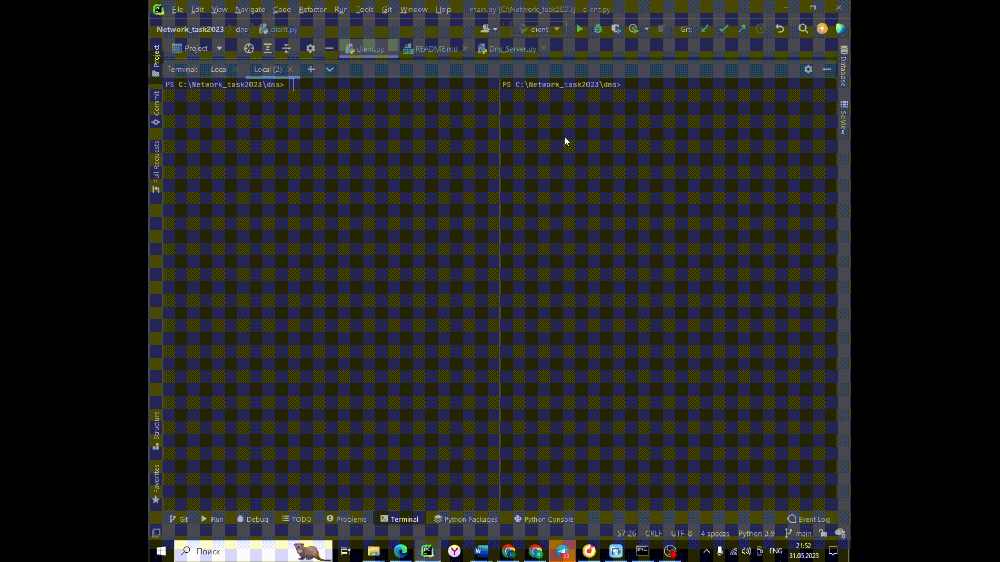

# Internet Protocols
## Task2.4: Caching DNS-server

### Описание:
Кэширующий DNS сервер. Сервер прослушивает 53 порт. Получает от клиента рекурсивный запрос и выполняет разрешение запроса. Сервер регулярно просматривает кэш и удаляет просроченные записи (используя поле TTL). Во время штатного выключения сервер сериализует данные из кэша, сохраняет их на диск. При повторных запусках сервер считывает данные с диска и удаляет просроченные записи, инициализирует таким образом свой кэш

### Демонстрация работы программы:

### Видео-объяснение:

https://www.youtube.com/watch?v=nuIYnv3wAAo
